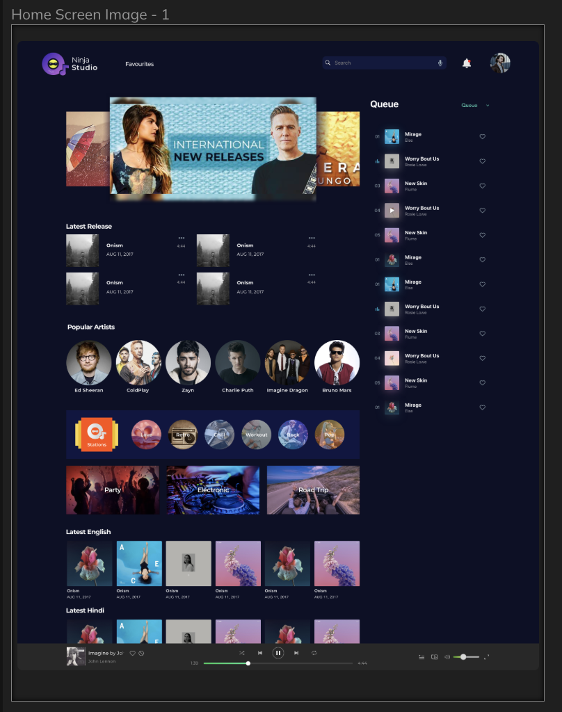
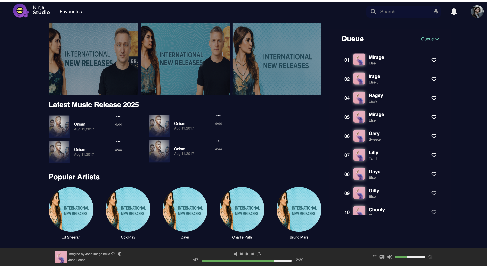

# Ninja Studio — Music Player Web App

A sleek and modern **Music Player Interface** built using **HTML, CSS, and minimal JavaScript**.
It’s inspired by real-world streaming apps and focuses on **UI/UX design, responsive layout**, and **smooth user interaction**.

---

## Features

- 🎵 **Modern Dark UI** inspired by Spotify/Apple Music
- 🎚️ Interactive **Play, Pause, Like, and Follow** buttons
- 💜 “Similar Artists” and “Recently Played” sections
- 🎧 Fully **responsive layout** for desktops and tablets
- ⚡ Built using **Pure HTML + CSS** and just a pinch of JavaScript
- 🖼️ Custom album art and artist previews

---

## 🧠 Technologies Used

| Technology               | Purpose                                 |
| ------------------------ | --------------------------------------- |
| **HTML5**                | Structuring content and semantic layout |
| **CSS3 (Flexbox, Grid)** | Styling and responsive design           |
| **JavaScript (Vanilla)** | Adding interactivity and small logic    |
| **Google Fonts & Icons** | Enhancing typography and icons          |

---

## 🖥️ Preview



---

## 🚀 Getting Started

### 1️⃣ Clone this repository

```bash
git clone https://github.com/kanishk-469/music-player-app.git
```

### 2️⃣ Open the project

Navigate into the folder:

```bash
cd music-player-app
```

### 3️⃣ Run it locally

Simply open the `index.html` file in your browser — no build tools needed!

---

## 🧩 Folder Structure

```
music-player-app/
│
├── index.html
├── playlist.html
├── styles/
│   └── index.css
├── scripts/
│   └── script.js
├── assets/
│   ├── images/
│
└── README.md
```

---

## 💡 Key Learning Highlights

- Mastered **modern CSS layout techniques** (Flexbox + Grid)
- Practiced **UI alignment, spacing, and color contrast**
- Implemented a **responsive card design**
- Understood how to **structure scalable front-end projects**

---

## 📸 Screenshots

| Desktop View                       | Recently Played Section          |
| ---------------------------------- | -------------------------------- |
|  |  |

---

## 🧑‍🎨 Author

**Kanishka Singh**
💌 [Connect on LinkedIn](https://www.linkedin.com/in/kanishka-singh-14291157/)
🐙 [GitHub](https://github.com/yourusername)

---

---

⭐ _If you like this project, please give it a star on GitHub!_
